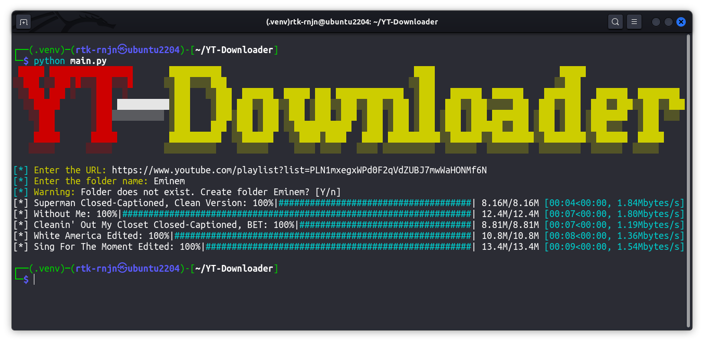
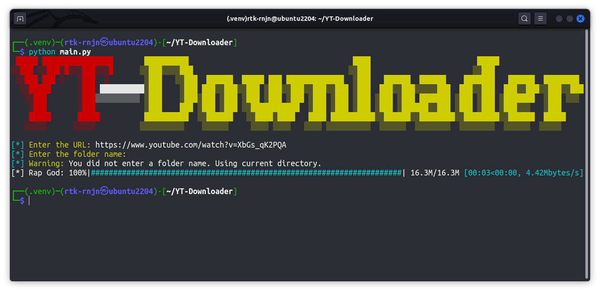

# YT-Downloader

Forked from [`abhirai7/YouTube-Playlist-Downloader`](https://github.com/abhirai7/YouTube-Playlist-Downloader).

This is a simple python script to download YouTube playlists and videos. It uses the `pytube` library to download videos.

## Installation

1. Clone the repository
2. Install the required libraries using `pip install -r requirements.txt`
3. Run the script using `python main.py`

## Why this fork?

I wanted to add a feature to the original script and make it look better, so I forked it. I will be adding more features to this script in the future.
Also, the original author just want to get things done and didn't care about the code quality, so I will be refactoring the code to make it more readable and maintainable.
And bit more flexible as you can download videos from a playlist or a single video.

## Why I removed the GUI?

CLI works better for me, and I don't want to maintain two different interfaces. So I decided to remove the GUI.
Secondly, python GUI libraries are not that good, and I don't want to use `tkinter` or `PyQt` for this simple script.
Thirdly, cloud services like `Heroku` don't support GUI applications.
Lastly, in many distro `tkinter` is not even installed.

## Screenshots

## Improvements?

Yes, feel free to open PR, or an issue.
